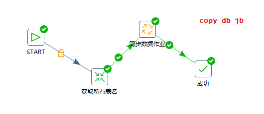
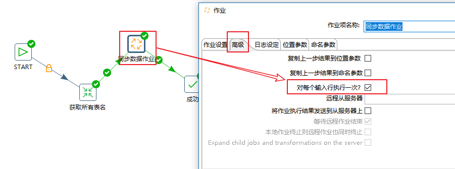
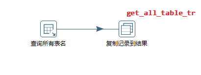
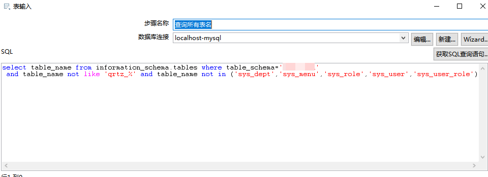
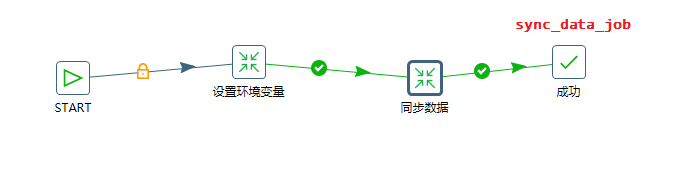
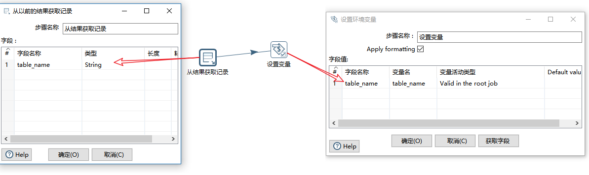
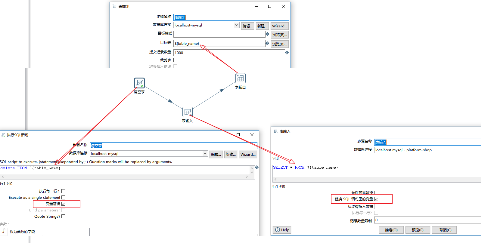

### 场景

使用Kettle实现不同环境的两个表结构相同的数据库表数据同步.

表不多的情况可以使用kettle的单表同步,如果表比较多可以使用以下方法实现批量更新

### 实现步骤

#### 1.总体步骤





创建作业(copy_db_jb)->获取所有数据库表名(get_all_table_tr)->创建作业(sync_data_job)

##### 配置sync_data_job:



### 具体细节(见截图)

#### 获取所有表名.tr





##### sql脚本

```sql
select table_name from information_schema.tables where table_schema='xxxx' 
```

查询数据库所有表名,对于一些设置了外键约束的表直接删除同步数据可能会报错,需单独处理,本次处理只做普通表的同步

#### 同步数据作业.jb



##### 设置环境变量.tr

从结果集中获取表名放入环境变量中



##### 同步数据.tr

先清空目标表数据,然后查询源表数据做数据插入

